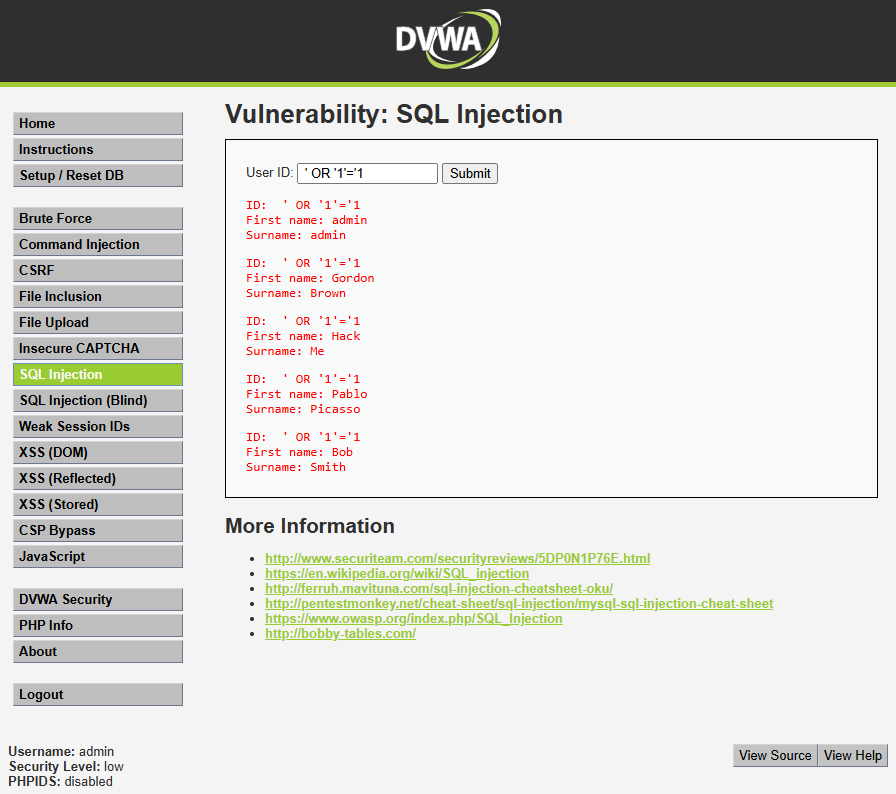
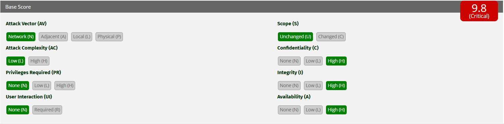

# Auditoría de Seguridad Web - MercadoSur
## Informe de Vulnerabilidad: Inyección SQL (SQLi)

### 1. Evidencia de Explotación en Entorno Controlado
**Objetivo de la prueba:** Evaluar la resiliencia de los formularios de entrada de datos contra inyecciones de código a nivel de base de datos.
**Entorno:** DVWA (Security Level: Low) simulando un buscador de clientes o panel de login sin sanitización en el e-commerce.
**Payload inyectado:** `' OR '1'='1`

*Figura 1: Explotación exitosa de la vulnerabilidad SQLi. El sistema interpreta el payload y retorna la totalidad de los registros de la tabla de usuarios, eludiendo los controles de acceso.*

### 2. Análisis Técnico de la Causa Raíz e Impacto
La vulnerabilidad documentada tiene su origen en una deficiencia crítica en la etapa de desarrollo: la concatenación insegura de cadenas de texto. La aplicación web toma el input no confiable proporcionado por el usuario y lo ensambla directamente dentro de la instrucción SQL que se envía al motor de la base de datos.

**Mecanismo de la falla:**
Una consulta legítima programada por el desarrollador en el backend suele tener esta estructura:
`SELECT nombre FROM users WHERE id = '$id'`

Al ingresar nuestro payload malicioso (`' OR '1'='1`), la consulta que finalmente procesa el motor de base de datos muta a la siguiente forma:
`SELECT nombre FROM users WHERE id = '' OR '1'='1'`

El primer apóstrofe inyectado cierra prematuramente el campo de texto esperado. A continuación, el operador lógico `OR` introduce la expresión matemática `'1'='1'`, la cual constituye una tautología (una condición que siempre es verdadera). Como el motor SQL evalúa la sentencia registro por registro y la condición "verdadero" se cumple en todos los casos, el sistema devuelve la tabla íntegra, saltándose cualquier mecanismo de autenticación o filtro.

**Impacto en el E-commerce MercadoSur:**
En el contexto del negocio auditado, esta falla es catastrófica. Si este vector estuviera presente en el formulario de inicio de sesión o en el buscador de facturas de MercadoSur, un atacante podría exfiltrar la base de datos completa. Esto incluye información de Identificación Personal (PII) de los clientes, contraseñas hasheadas, historiales de compras e, inherentemente, podría derivar en robo de datos financieros o pasarelas de pago, exponiendo a MercadoSur a multas regulatorias severas y pérdida total de la confianza del consumidor.

### 3. Puntuación y Severidad (Métrica CVSS v3.1)
Para estandarizar la gravedad del hallazgo, se aplica la calculadora del *Common Vulnerability Scoring System*.

*Figura 2: Puntuación CVSS v3.1 para la vulnerabilidad de Inyección SQL, resultando en un Base Score de 9.8 (Crítica).*

**Análisis y Justificación de Severidad a Nivel Profesional (Vector: AV:N/AC:L/PR:N/UI:N/S:U/C:H/I:H/A:H):**
* **Attack Vector (AV) - Network:** La vulnerabilidad reside en un componente web (buscador o portal de login de MercadoSur) y es explotable de forma remota a través de Internet.
* **Attack Complexity (AC) - Low:** La ejecución del ataque es trivial. El payload utilizado (`' OR '1'='1`) no requiere evadir mitigaciones complejas.
* **Privileges Required (PR) - None:** El atacante no necesita credenciales previas ni estar autenticado en el portal de MercadoSur.
* **User Interaction (UI) - None:** La explotación es directa entre el atacante y el servidor, sin requerir que una víctima haga clic en nada.
* **Scope (S) - Unchanged:** El ataque compromete la base de datos de la aplicación, pero no salta hacia otros componentes aislados de la infraestructura.
* **Confidentiality - High:** La inyección permite la lectura completa de todas las tablas, exponiendo información confidencial de clientes, registros de compras y credenciales.
* **Integrity - High:** El atacante tiene la capacidad de modificar, alterar o corromper cualquier registro existente en la base de datos mediante sentencias maliciosas como `UPDATE` o `INSERT`.
* **Availability - High:** El atacante puede denegar el servicio eliminando tablas críticas (`DROP TABLE`), lo que paralizaría por completo la operación comercial del e-commerce.

### 4. Políticas de Prevención (Estrategias de Código Seguro)
Para erradicar la causa raíz de esta vulnerabilidad, el equipo de desarrollo de MercadoSur debe abandonar inmediatamente la práctica de concatenación de cadenas SQL. La política de prevención obligatoria a implementar es el uso de **Consultas Parametrizadas (Prepared Statements)**.

Las consultas parametrizadas operan en dos fases distintas: primero, la aplicación envía la estructura estricta del código SQL al motor de la base de datos con marcadores de posición (por ejemplo, `?`). En segundo lugar, envía los datos del usuario por un canal separado. Al compilar la estructura antes de insertar los datos, el motor de la base de datos garantiza que cualquier input (incluso si contiene comillas o sentencias lógicas como `OR '1'='1'`) sea tratado estricta y puramente como un valor de texto literal, neutralizando por completo la posibilidad de que se ejecute como código malicioso.

Como política complementaria, se debe establecer la validación de tipos de datos en el backend, forzando a que las variables de ID sean estrictamente valores enteros (`int`) antes de interactuar con el modelo de datos.

### 5. Controles de Mitigación (Defensa en Profundidad)
Asumiendo que el factor de error humano en el desarrollo siempre existe, MercadoSur debe implementar controles de mitigación a nivel de infraestructura para contener el daño potencial, basándose en los estándares del marco **OWASP**:

1.  **Principio de Menor Privilegio (PoLP) en BD:** La aplicación web del e-commerce no debe conectarse al motor SQL utilizando usuarios administrativos (como `sa` o `root`). Se deben crear cuentas de servicio dedicadas que únicamente posean permisos `SELECT`, `INSERT` y `UPDATE` sobre las tablas estrictamente necesarias, revocando cualquier permiso para eliminar (`DROP`, `TRUNCATE`) tablas o interactuar con el esquema interno del sistema operativo.
2.  **Implementación de un WAF (Web Application Firewall):** Desplegar un firewall de capa 7 (aplicación) en el perímetro de la red. El WAF es capaz de analizar el tráfico HTTP entrante en tiempo real y, mediante firmas de comportamiento, bloquear peticiones maliciosas que contengan patrones característicos de SQLi (como sintaxis de inyección, caracteres de escape anómalos o palabras clave de bases de datos) antes de que la petición toque los servidores de la aplicación de MercadoSur.