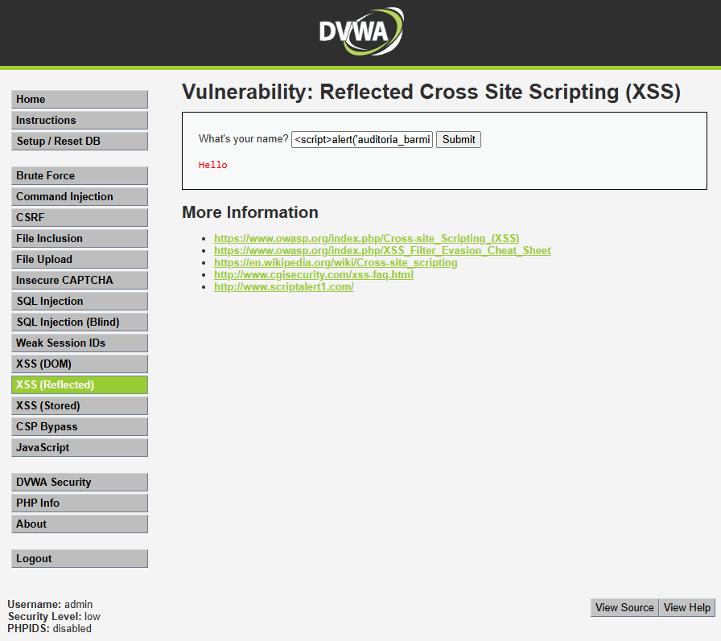
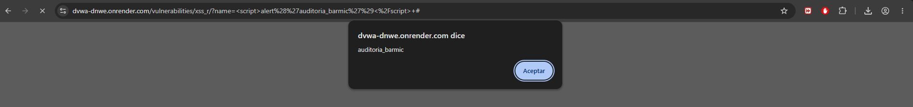
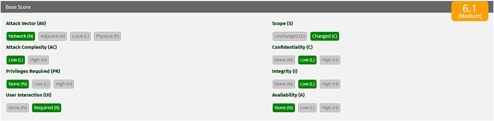

# Auditoría de Seguridad Web - MercadoSur
## Informe de Vulnerabilidad: Cross-Site Scripting Reflejado (XSS)

### 1. Evidencia de Explotación en Entorno Controlado
**Objetivo de la prueba:** Verificar si la aplicación web procesa de forma segura las entradas del usuario antes de reflejarlas en el navegador.
**Entorno:** DVWA (Security Level: Low) simulando un motor de búsqueda de productos o un saludo de perfil en el e-commerce.
**Payload inyectado:** ``

*Figura 1: Inyección del payload de JavaScript en el campo de texto vulnerable.*

*Figura 2: Ejecución exitosa del script en el navegador. La aplicación devuelve el texto sin procesar y el navegador lo interpreta como código ejecutable.*

### 2. Análisis Técnico de la Causa Raíz e Impacto
La vulnerabilidad XSS ocurre porque la aplicación no distingue entre la entrada del usuario y el código propio de la página HTML. En este tipo Reflejado, la entrada maliciosa viaja en la URL o en el parámetro de la petición y el servidor la inserta inmediatamente en la respuesta HTTP sin sanitizarla.

**Mecanismo de la falla:**
Cuando un usuario ingresa el nombre, el servidor lo procesa e inserta en la etiqueta HTML. Sin embargo, al ingresar nuestro payload, el servidor devuelve `
Hello 
` sin aplicarle filtros. El navegador de la víctima recibe esta respuesta y ejecuta el bloque de JavaScript, asumiendo que es código legítimo del sitio web.

**Impacto en el E-commerce MercadoSur:**
Si un atacante envía un enlace manipulado (con el payload en la URL) a los clientes de MercadoSur, podría ejecutar código silencioso en sus navegadores. Esto permite el robo de la sesión de otro usuario (Session Hijacking), lo que facultaría al atacante para suplantar la identidad del cliente, acceder a sus tarjetas guardadas, ver su historial de pedidos o presentarle un formulario fraudulento para clonar sus credenciales bancarias.

### 3. Puntuación y Severidad CVSS v3.1
Para evaluar el riesgo estándar de esta vulnerabilidad reflejada, utilizamos la calculadora oficial.

*Figura 3: Puntuación CVSS v3.1 para la vulnerabilidad XSS Reflejado, resultando en un Base Score de 6.1 (Medio).*

**Análisis y Justificación de Severidad a Nivel Profesional (Vector: AV:N/AC:L/PR:N/UI:R/S:C/C:L/I:L/A:N):**
* **Attack Vector (AV) - Network:** Se explota por internet enviando un enlace manipulado.
* **Attack Complexity (AC) - Low:** El payload es básico y directo; no hay mecanismos de evasión que sortear.
* **Privileges Required (PR) - None:** El atacante no necesita credenciales en MercadoSur para armar y enviar el enlace.
* **User Interaction (UI) - Required:** El atacante necesita obligatoriamente que un cliente legítimo haga clic en el enlace infectado para que el script se ejecute en su navegador local.
* **Scope (S) - Changed:** La falla original está en el código del servidor de MercadoSur, pero el impacto ocurre en un entorno completamente distinto: el navegador del cliente final.
* **Confidentiality & Integrity - Low:** Permite leer datos locales del navegador de la víctima, como cookies sin protección (Confidencialidad Baja), y alterar la apariencia del sitio (Integridad Baja). 
* **Availability - None:** El ataque no afecta la estabilidad ni disponibilidad de los servidores de MercadoSur.

### 4. Políticas de Prevención (Estrategias de Código Seguro)
Para erradicar el XSS, la política obligatoria de desarrollo para MercadoSur es **Escapar la salida (Output Encoding)** en todas las vistas de la aplicación. 
Antes de renderizar cualquier dato ingresado por el usuario en el HTML, el código debe convertir caracteres peligrosos en sus entidades HTML seguras (por ejemplo, convertir `<` en `&lt;` para que se vea como texto, no como código). De esta manera, el navegador representará el payload literalmente como un texto visual y jamás lo ejecutará como código de programación.

### 5. Controles de Mitigación (Defensa en Profundidad)
Siguiendo las directrices del marco OWASP, se deben implementar controles arquitectónicos:
1. **Content Security Policy (CSP):** Implementar cabeceras HTTP CSP estrictas que limiten de qué dominios específicos el navegador tiene permitido descargar y ejecutar scripts. Esto neutraliza el ataque impidiendo la ejecución de scripts no autorizados o inyectados en línea (inline scripts).
2. **Flags de Seguridad en Cookies:** Configurar todas las cookies de sesión del e-commerce con el atributo `HttpOnly`. Esto impide que cualquier código JavaScript (incluyendo los inyectados vía XSS) pueda leer o robar el identificador de sesión del cliente.