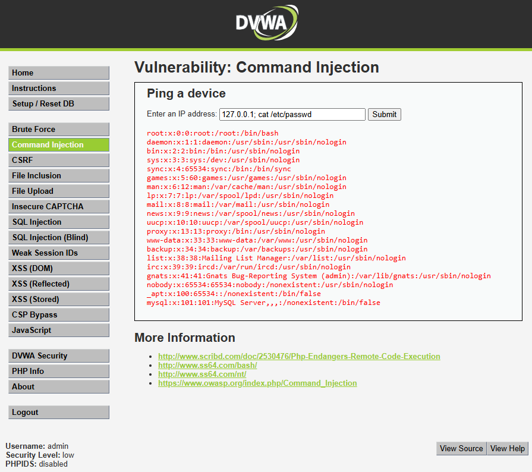

# Auditoría de Seguridad Web - MercadoSur
## Informe de Vulnerabilidad: Inyección de Comandos (OS Command Injection)

### 1. Evidencia de Explotación en Entorno Controlado
**Objetivo de la prueba:** Verificar si la aplicación transfiere la entrada del usuario directamente al sistema operativo sin validación.
**Entorno:** DVWA (Security Level: Low) simulando una herramienta de diagnóstico de red, conversor de imágenes o sistema de envíos del e-commerce.
**Payload inyectado:** `127.0.0.1; cat /etc/passwd`

*Figura 1: Además de la respuesta del ping esperado, el servidor procesa el comando inyectado y muestra el contenido de /etc/passwd revelando las cuentas del sistema operativo.*

### 2. Análisis Técnico de la Causa Raíz e Impacto
Esta vulnerabilidad crítica surge por transferir la entrada del usuario directamente al sistema operativo host. La aplicación web carece de sanitización y asume de manera equivocada que el usuario ingresará únicamente los datos esperados (una IP).

**Mecanismo de la falla:**
El código de la aplicación está diseñado para ejecutar un ping sobre el valor ingresado. Sin embargo, en entornos Unix/Linux, la terminal usa el carácter punto y coma (`;`) para indicar "ejecutar un comando y, a continuación, el siguiente". 
Al ingresar `127.0.0.1; cat /etc/passwd`, la aplicación de MercadoSur le entrega al sistema operativo una línea combinada. El intérprete ejecuta la primera tarea (el ping inofensivo) y, sin detenerse, ejecuta inmediatamente la segunda instrucción maliciosa, devolviendo la lectura del archivo interno de Linux que lista las cuentas del sistema.

**Impacto en el E-commerce MercadoSur:**
Equivale al control total del servidor. Es una de las vulnerabilidades más críticas. Un atacante podría leer el código fuente de MercadoSur, extraer credenciales en texto plano de bases de datos o pasarelas de pago, instalar software de minería o backdoors, e incluso pivotar hacia otros servidores privados de la red interna de la empresa.

### 3. Puntuación y Severidad CVSS v3.1
**Puntuación CVSS Resultante:** **9.8 (CRÍTICA)**

**Análisis y Justificación de Severidad a Nivel Profesional (Vector: AV:N/AC:L/PR:N/UI:N/S:U/C:H/I:H/A:H):**
* **Attack Vector (AV) - Network:** Explotable remotamente desde internet mediante cualquier formulario vulnerable expuesto por el e-commerce.
* **Attack Complexity (AC) - Low:** El uso del separador `;` para encadenar comandos es un comportamiento estándar y trivial del shell; no se requiere evadir mitigaciones complejas.
* **Privileges Required (PR) - None:** No se requiere una cuenta de administrador ni cliente para lanzar la petición si el endpoint es público.
* **User Interaction (UI) - None:** Completamente automatizable por el atacante sin requerir interacción de una víctima (a diferencia del XSS).
* **Scope (S) - Unchanged:** El ataque se concentra en tomar control del entorno de ejecución actual (el servidor web vulnerable).
* **Confidentiality, Integrity, Availability - High (Alta):** Impacto máximo en la tríada CIA. El atacante obtiene Ejecución de Código Remota (RCE). Puede leer cualquier archivo (Confidencialidad), alterar el código del sitio web o instalar malware (Integridad) y formatear el disco o tumbar los servicios de la tienda online (Disponibilidad).

### 4. Políticas de Prevención (Estrategias de Código Seguro)
La directriz primordial de desarrollo para MercadoSur debe ser **no transferir la entrada del usuario directamente al sistema operativo**. 
Se debe prohibir el uso de funciones que invoquen la terminal de comandos de forma directa si existe una alternativa nativa dentro del lenguaje (por ejemplo, usar APIs de red o librerías internas para resolución DNS). Si invocar al shell es absolutamente necesario, se deben implementar **Listas Blancas** estrictas: por ejemplo, aceptar únicamente valores que cumplan con el formato exacto de una dirección IP (solo números y puntos), rechazando cualquier otro carácter especial en la validación.

### 5. Controles de Mitigación (Defensa en Profundidad)
A nivel de arquitectura, MercadoSur debe protegerse asumiendo que el código puede fallar:
1. **Principio del Menor Privilegio (PoLP):** El servicio web de la tienda (Nginx, Apache, Node) jamás debe ejecutarse como administrador (`root`). Se le debe asignar un usuario limitado del sistema que no tenga permisos para modificar configuraciones críticas ni leer directorios confidenciales como `/etc/shadow`.
2. **Sandboxing / Contenedores:** La aplicación debe aislarse utilizando tecnologías de contenedores (como Docker) o entornos *chroot*. Si un atacante inyecta comandos, quedará atrapado en un sistema de archivos restringido sin acceso a la máquina host real de MercadoSur.